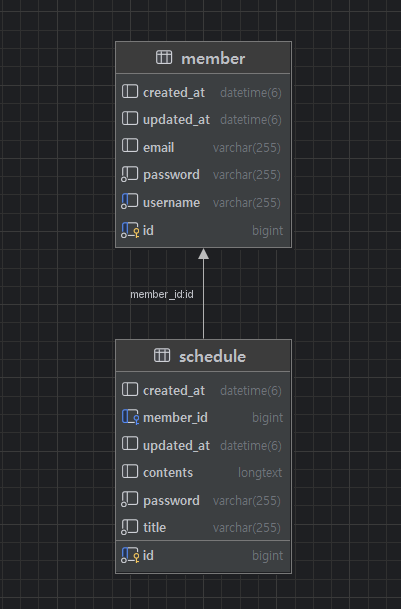

# CH3 일정 관리 앱 Develop

## API 명세서 작성

| API 명세 | Method | URL             |
|------|--------|-----------------|
| 로그인  | POST   | /login          |
| 회원가입 | POST   | /signup         |
| 회원생성 | POST   | /members        |
| 회원 전체조회 | GET    | /members        |
| 회원 단건조회 | GET    | /members/{id}   |
| 회원 수정 | PATCH  | /members/{id}   |
| 회원 삭제 | DELETE | /members/{id}   |
| 로그아웃 | DELETE | /logout         | 
| 일정생성 | POST   | /schedules      |
| 일정전체조회 | GET    | /schedules      |
| 일정 단건조회 | GET    | /schedules/{id} |
| 일정 수정 | PATCH  | /schedules/{id} |
| 일정 삭제 | DELETE | /schedules/{id} |


## 로그인(Login)
개요

URL: /login

HTTP METHOD: POST

설명예시: 로그인하는 API입니다.

### 요청(Request)

Param

설명

| 키 | 데이터타입 | 설명 |
|---|-------|----|
| - | -     | -  |

예시
``` json
emtpy
```

body(json)

| 키          | 데이터타입         | 설명            |
|------------|---------------|---------------|
| username   | String        | 작성자           |
| password   | String        | 비밀번호          |
| email      | String        | 이메일           |


예시
``` json
{
"username" : "yongjun",
"password" : "1234",
"email" : "yoyo99828@naver.com"
}
```

### 응답(Response)

성공응답

설명

| 키      | 데이터타입   | 설명   |
|--------|---------|------|
| date   | Object  | 핵심데이터 |
| status | int     | 상태코드 |
| id     | long    | 생성된 할일 식별자 |


예시
``` json
{
"status" : 200
"data" : {
"id" : 1
  }
}
```

실패응답

설명

| 키       | 데이터타입  | 설명       |
|---------|--------|----------|
| status  | int    | 상태코드     |
| message | String | 에러관련 메세지 |

예시
``` json
{
"status" : 401
"message" : "의문의 에러가 발생했습니다."
}
```

## 회원가입(SingUp)
개요

URL: /signup

HTTP METHOD: POST

설명예시: 회원가입하는 API입니다.

### 요청(Request)

Param

설명

| 키 | 데이터타입 | 설명 |
|---|-------|----|
| - | -     | -  |

예시
``` json
emtpy
```

body(json)

| 키          | 데이터타입         | 설명            |
|------------|---------------|---------------|
| username   | String        | 작성자           |
| password   | String        | 비밀번호          |
| email      | String        | 이메일           |


예시
``` json
{
"username" : "yongjun",
"password" : "1234",
"email" : "yoyo99828@naver.com"
}
```

### 응답(Response)

성공응답

설명

| 키      | 데이터타입  | 설명         |
|--------|--------|------------|
| date   | Object | 핵심데이터      |
| status | int    | 상태코드       |
| id     | long   | 생성된 할일 식별자 |
| username   | String        | 작성자  |
| password   | String        | 비밀번호 |
| email      | String        | 이메일  |


예시
``` json
{
"status" : 200
"data" : {
"id" : 1,
"username" : "yongjun",
"password" : "1234",
"email" : "yoyo99828@naver.com"
  }
}
```

실패응답

설명

| 키       | 데이터타입  | 설명       |
|---------|--------|----------|
| status  | int    | 상태코드     |
| message | String | 에러관련 메세지 |

예시
``` json
{
"status" : 401
"message" : "의문의 에러가 발생했습니다."
}
```

## 회원생성
개요

URL: /members

HTTP METHOD: POST
 
설명예시: 회원을 생성하는 API입니다.

### 요청(Request)

Param

설명

| 키 | 데이터타입 | 설명 |
|---|-------|----|
| - | -     | -  |

예시
``` json
emtpy
```

body(json)

| 키        | 데이터타입  | 설명   |
|----------|--------|------|
| username | String | 작성자  |
| password | String | 비밀번호 |
| email    | String | 이메일  |


예시
``` json
{
"username" : "yongjun",
"password" : "1234",
"email" : "yoyo99828@naver.com"
}
```

### 응답(Response)

성공응답

설명

| 키      | 데이터타입    | 설명    |
|--------|----------|-------|
| date   | Object   | 핵심데이터 |
| status | int      | 상태코드  |
| id     | long     | 생성된 할일 식별자 |
| username   | String        | 작성자   |
| password   | String        | 비밀번호  |
| email      | String        | 이메일   |


예시
``` json
{
"status" : 200
"data" : {
"id" : 1
"username" : "yongjun",
"password" : "1234",
"email" : "yoyo99828@naver.com"
  }
}
```

실패응답

설명

| 키       | 데이터타입  | 설명       |
|---------|--------|----------|
| status  | int    | 상태코드     |
| message | String | 에러관련 메세지 |

예시
``` json
{
"status" : 401
"message" : "의문의 에러가 발생했습니다."
}
```

## 회원전체조회
개요

URL: /members

HTTP METHOD: GET

설명예시: 회원의 정보를 전체 조회하는 API입니다.

### 요청(Request)

Param

설명

| 키 | 데이터타입 | 설명 |
|---|-------|----|
| - | -     | -  |

예시
``` json
emtpy
```
body(json)

| 키          | 데이터타입    | 설명            |
|------------|----------|---------------|
| username | String        | 작성자  |
| password | String        | 비밀번호 |
| email    | String        | 이메일  |

예시
``` json
{
"username" : "yongjun",
"password" : "1234",
"email" : "yoyo99828@naver.com"
}
```

### 응답(Response)

성공응답

설명

| 키      | 데이터타입    | 설명         |
|--------|----------|------------|
| date   | Object   | 핵심데이터      |
| status | int      | 상태코드       |
| id     | long     | 생성된 할일 식별자 |

예시
``` json
{
"status" : 200
"data" : {
[
 {
  "id" : 1,
  "username" : "yongjun",
  "password" : "1234",
  "email" : "yoyo99828@naver.com"
 }
 {
  "id" : 2,
  "username" : "john",
  "password" : "1234",
  "email" : "yoyo99@naver.com"
 } 
]
}
```


실패응답

설명

| 키       | 데이터타입  | 설명       |
|---------|--------|----------|
| status  | int    | 상태코드     |
| message | String | 에러관련 메세지 |

예시
``` json
{
"status" : 400
"message" : "의문의 에러가 발생했습니다."
}
```

## 회원단건조회
개요

URL: /members/{id}

HTTP METHOD: GET

설명예시: 회원의 정보를 단건 조회하는 API입니다.

### 요청(Request)

Param

설명

| 키 | 데이터타입 | 설명 |
|---|-------|----|
| - | -     | -  |

예시
``` json
emtpy
```
body(json)

| 키          | 데이터타입         | 설명    |
|------------|---------------|-------|
| username | String        | 작성자   |
| password | String        | 비밀번호  |
| email    | String        | 이메일   |

예시
``` json
{
  "username" : "yongjun",
  "password" : "1234",
  "email" : "yoyo99828@naver.com"
}
```

### 응답(Response)

성공응답

설명

| 키      | 데이터타입  | 설명         |
|--------|--------|------------|
| date   | Object | 핵심데이터      |
| status | int    | 상태코드       |
| id     | long   | 생성된 할일 식별자 |
| username | String | 작성자  |
| password | String | 비밀번호 |
| email    | String | 이메일  |

예시
``` json
{
"status" : 200
"data" : {
   "id" : 1
   "username" : "yongjun",
   "password" : "1234",
   "email" : "yoyo99828@naver.com"
  }
}
```

실패응답

설명

| 키       | 데이터타입  | 설명       |
|---------|--------|----------|
| status  | int    | 상태코드     |
| message | String | 에러관련 메세지 |

예시
``` json
{
"status" : 400
"message" : "의문의 에러가 발생했습니다."
}
```

## 회원수정
개요

URL: /members/{id}

HTTP METHOD: PATCH

설명예시: 회원의 정보를 수정하는 API입니다.

### 요청(Request)

Param

설명

| 키 | 데이터타입 | 설명 |
|---|-------|----|
| - | -     | -  |

예시
``` json
emtpy
```

body(json)

| 키        | 데이터타입         | 설명   |
|----------|---------------|------|
| username | String        | 작성자  |
| password | String        | 비밀번호 |
| email    | String        | 이메일  |

예시
``` json
{
  "username" : "john",
  "password" : "1234",
  "email" : "yoyo9092@naver.com"
}
```

### 응답(Response)

성공응답

설명

| 키      | 데이터타입    | 설명         |
|--------|----------|------------|
| date   | Object   | 핵심데이터      |
| status | int      | 상태코드       |
| id     | long     | 생성된 할일 식별자 |

예시
``` json
{
"status" : 200
"data" : {
"id" : 1
  }
}
```

실패응답

설명

| 키       | 데이터타입  | 설명       |
|---------|--------|----------|
| status  | int    | 상태코드     |
| message | String | 에러관련 메세지 |

예시
``` json
{
"status" : 401
"message" : "의문의 에러가 발생했습니다."
}
```


## 회원삭제
개요
URL: /members
HTTP METHOD: DELETE
설명예시: 회원을 삭제하는 API입니다.

### 요청(Request)

Param

설명

| 키        | 데이터타입  | 설명     |
|----------|--------|--------|
| password | String | 비밀번호입력 |

예시
``` json
password "1234"
```

body(json)

| 키        | 데이터타입    | 설명   |
|----------|----------|------|
| username | String   | 작성자  |
| password | String   | 비밀번호 |
| email    | String   | 이메일  |

예시
``` json
{
    "username" : "yongjun",
    "password" : "1234",
    "email" : "yoyo99828@naver.com"
}
```

### 응답(Response)

성공응답

설명

| 키      | 데이터타입    | 설명         |
|--------|----------|------------|
| date   | Object   | 핵심데이터      |
| status | int      | 상태코드       |


예시
``` json
{
"status" : 200
"data" : {
  }
}
```

실패응답

설명

| 키        | 데이터타입  | 설명       |
|----------|--------|----------|
| status   | int    | 상태코드     |
| message  | String | 에러관련 메세지 |

예시
``` json
{
"status" : 400
"message" : "의문의 에러가 발생했습니다."
}
```


## 로그아웃(Logout)
개요
URL: /logout
HTTP METHOD: DELETE
설명예시: 회원을 삭제하는 API입니다.

### 요청(Request)

Param

설명

| 키        | 데이터타입  | 설명     |
|----------|--------|--------|
| password | String | 비밀번호입력 |

예시
``` json
"password" : "1234"
```

body(json)

| 키        | 데이터타입    | 설명   |
|----------|----------|------|
| username | String   | 작성자  |
| password | String   | 비밀번호 |
| email    | String   | 이메일  |

예시
``` json
{
    "username" : "yongjun",
    "password" : "1234",
    "email" : "yoyo99828@naver.com"
}
```

### 응답(Response)

성공응답

설명

| 키      | 데이터타입    | 설명         |
|--------|----------|------------|
| date   | Object   | 핵심데이터      |
| status | int      | 상태코드       |


예시
``` json
{
"status": 200
"data": {
  }
}
```

실패응답

설명

| 키        | 데이터타입  | 설명       |
|----------|--------|----------|
| status   | int    | 상태코드     |
| message  | String | 에러관련 메세지 |

예시
``` json
{
"status" : 400
"message" : "의문의 에러가 발생했습니다."
}
```

## 일정생성
개요

URL: /schedules

HTTP METHOD: POST

설명예시: 일정을 생성하는 API입니다.

### 요청(Request)

Param

설명

| 키 | 데이터타입 | 설명 |
|---|-------|----|
| - | -     | -  |

예시
``` json
emtpy
```

body(json)

| 키        | 데이터타입  | 설명   |
|----------|--------|------|
| title    | String | 할일제목 |
| contents | String | 할일내용 |
| password | String | 비밀번호 |

예시
``` json
{
    "title" : "오늘이다",
    "contents" : "공부",
    "password" : "1234"
}
```

### 응답(Response)

성공응답

설명

| 키          | 데이터타입 | 설명         |
|------------|---|------------|
| date       | Object | 핵심데이터      |
| status     | int | 상태코드       |
| id         | long | 생성된 할일 식별자 |
| title      | String | 할일제목       |
| contents   | String | 할일내용       |
| password   | String | 비밀번호       |
| updated_at | LocalDateTime | 수정일        |


예시
``` json
{
"status" : 200
"data" : {
    "id" : 1,
    "title" : "오늘이다",
    "contents" : "공부",
    "password" : "1234"
    "updated_at" : "2025-05-24 00:53:51"
  }
}
```

실패응답

설명

| 키       | 데이터타입  | 설명       |
|---------|--------|----------|
| status  | int    | 상태코드     |
| message | String | 에러관련 메세지 |

예시
``` json
{
"status" : 401
"message" : "의문의 에러가 발생했습니다."
}
```

## 일정전체조회
개요

URL: /schedules

HTTP METHOD: GET

설명예시: 일정의 정보를 전체 조회하는 API입니다.

### 요청(Request)

Param

설명

| 키 | 데이터타입 | 설명 |
|---|-------|----|
| - | -     | -  |

예시
``` json
emtpy
```
body(json)

| 키          | 데이터타입    | 설명            |
|------------|----------|---------------|
| title      | String | 할일제목       |
| contents   | String | 할일내용       |
| password   | String | 비밀번호       |

예시
``` json
{
  "title" : "코딩공부하기",
  "contents": "하나씩 알아가는 중",
  "password": "1234"
}
```

### 응답(Response)

성공응답

설명

| 키      | 데이터타입    | 설명  |
|--------|----------|-----|
| date   | Object   | 핵심데이터 |
| status | int      | 상태코드 |
| id     | long     | 생성된 할일 식별자 |
| title      | String | 할일제목 |
| contents   | String | 할일내용 |
| password   | String | 비밀번호 |
| updated_at | LocalDateTime | 수정일 |

예시
``` json
{
"status" : 200
"data" : {
 ]
  {
   "id" : 1,
   "title" : "코딩공부하기",
   "contents" : "하나씩 알아가는 중",
   "password" : "1234",
   "updated_at" : "2025-05-24 00:53:51"
   }
   "id": 2,
   "title" : "TIL 작성하기",
   "contents" : "오늘 배운 내용 정리",
   "password" : "1234",
   "updated_at" : "2025-05-24 00:53:51"
   }
 ]
}
```


실패응답

설명

| 키       | 데이터타입  | 설명       |
|---------|--------|----------|
| status  | int    | 상태코드     |
| message | String | 에러관련 메세지 |

예시
``` json
{
"status" : 400
"message" : "의문의 에러가 발생했습니다."
}
```

## 일정단건조회
개요

URL: /members/{id}

HTTP METHOD: GET

설명예시: 회원의 정보를 단건 조회하는 API입니다.

### 요청(Request)

Param

설명

| 키 | 데이터타입 | 설명 |
|---|-------|----|
| - | -     | -  |

예시
``` json
emtpy
```
body(json)

| 키          | 데이터타입         | 설명           |
|------------|---------------|--------------|
| title      | String | 할일제목       |
| contents   | String | 할일내용       |
| password   | String | 비밀번호       |

예시
``` json
{
"id" : 1
   "title" : "코딩공부하기",
   "contents" : "하나씩 알아가는 중",
   "password" : "1234"
}
```

### 응답(Response)

성공응답

설명

| 키      | 데이터타입    | 설명         |
|--------|----------|------------|
| date   | Object   | 핵심데이터      |
| status | int      | 상태코드       |
| id     | long     | 생성된 할일 식별자 |
| title      | String | 할일제목 |
| contents   | String | 할일내용 |
| password   | String | 비밀번호 |
| updated_at | LocalDateTime | 수정일 |

예시
``` json
{
"status": 200
"data": {
   "id": 1,
   "title" : "코딩공부하기",
   "contents" : "하나씩 알아가는 중",
   "password" : "1234",
   "updated_at" : "2025-05-24 00:53:51"
  }
}
```

실패응답

설명

| 키       | 데이터타입  | 설명       |
|---------|--------|----------|
| status  | int    | 상태코드     |
| message | String | 에러관련 메세지 |

예시
``` json
{
"status" : 400
"message" : "의문의 에러가 발생했습니다."
}
```

## 일정수정
개요

URL: /members/{id}

HTTP METHOD: PATCH

설명예시: 회원의 정보를 수정하는 API입니다.

### 요청(Request)

Param

설명

| 키 | 데이터타입 | 설명 |
|---|-------|----|
| - | -     | -  |

예시
``` json
emtpy
```

body(json)

| 키          | 데이터타입         | 설명           |
|------------|---------------|--------------|
| title      | String | 할일제목       |
| contents   | String | 할일내용       |
| password   | String | 비밀번호       |

예시
``` json
{
   "title" : "게임하기",
   "contents" : "마음을 편하게 하기",
   "password" : "1234",
}
```

### 응답(Response)

성공응답

설명

| 키      | 데이터타입    | 설명         |
|--------|----------|------------|
| date   | Object   | 핵심데이터      |
| status | int      | 상태코드       |
| id     | long     | 생성된 할일 식별자 |
| title      | String | 할일제목       |
| contents   | String | 할일내용       |
| password   | String | 비밀번호       |
| updated_at | LocalDateTime | 수정일        |

예시
``` json
{
"status" : 200
"data" : {
   "id" : 1,
   "title" : "게임하기",
   "contents" : "마음을 편하게 하기",
   "password" : "1234",
   "updated_at" : "2025-05-24 00:53:51"
  }
}
```

실패응답

설명

| 키       | 데이터타입  | 설명       |
|---------|--------|----------|
| status  | int    | 상태코드     |
| message | String | 에러관련 메세지 |

예시
``` json
{
"status" : 401
"message" : "의문의 에러가 발생했습니다."
}
```


## 회원삭제
개요
URL: /members
HTTP METHOD: DELETE
설명예시: 회원을 삭제하는 API입니다.

### 요청(Request)

Param

설명

| 키        | 데이터타입  | 설명     |
|----------|--------|--------|
| password | String | 비밀번호입력 |

예시
``` jso
"password" : "1234"
```

body(json)

| 키        | 데이터타입   | 설명   |
|----------|---------|------|
| title    | String  | 할일제목 |
| contents | String  | 할일내용 |
| password | String  | 비밀번호 |

예시
``` json
{

}
```

### 응답(Response)

성공응답

설명

| 키      | 데이터타입    | 설명         |
|--------|----------|------------|
| date   | Object   | 핵심데이터      |
| status | int      | 상태코드       |


예시
``` json
{
"status" : 200
"data" : {
  }
}
```

실패응답

설명

| 키        | 데이터타입  | 설명       |
|----------|--------|----------|
| status   | int    | 상태코드     |
| message  | String | 에러관련 메세지 |

예시
``` json
{
"status" : 400
"message" : "의문의 에러가 발생했습니다."
}
```


# ERD 작성

